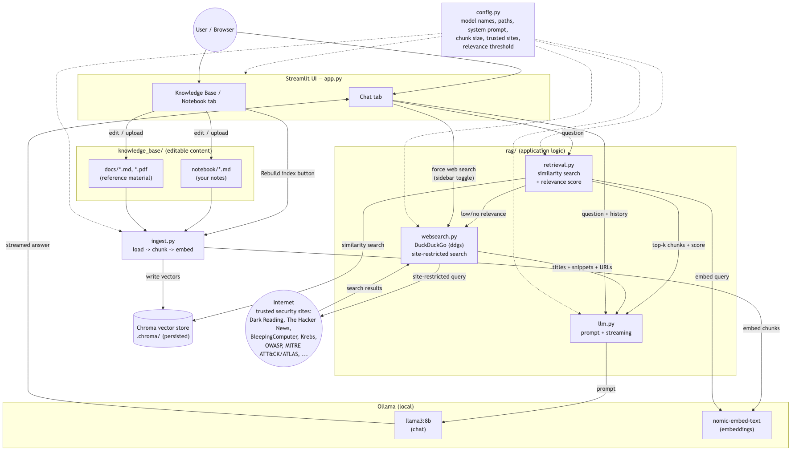
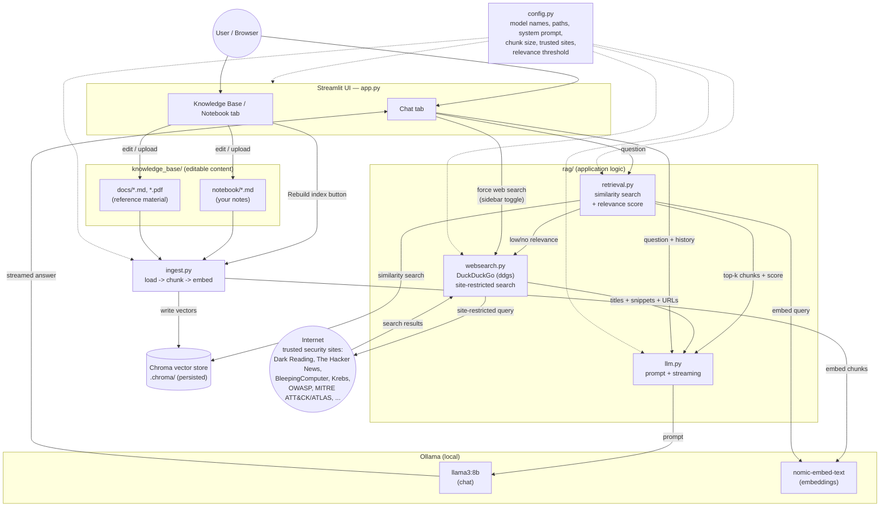

# Architecture

## Diagram



<details>
<summary>Mermaid source (also in docs_assets/architecture.mmd)</summary>



</details>

To regenerate the PNG after editing the diagram, run:
```bash
npx -y @mermaid-js/mermaid-cli -i docs_assets/architecture.mmd -o docs_assets/architecture.png -b transparent -w 1600
```

## Artifact reference

| Artifact | Role |
|---|---|
| [`app.py`](app.py) | Streamlit entrypoint. Renders the Chat tab and Knowledge Base / Notebook tab; wires user input to `rag/` and `knowledge_base/`. |
| [`config.py`](config.py) | Single source of truth for model names (`LLM_MODEL`, `EMBED_MODEL`), paths, chunk size/overlap, retrieval `k`, the system prompt, trusted security sites, and the KB relevance threshold. |
| [`ingest.py`](ingest.py) | Batch job: loads every file under `knowledge_base/`, splits into chunks, embeds them, and rebuilds `.chroma/` from scratch. Run via CLI or the "Rebuild index" button in the UI. |
| [`rag/retrieval.py`](rag/retrieval.py) | Opens the persisted Chroma store, runs similarity search for a given question, and returns a relevance score used to decide whether the KB has a good answer. |
| [`rag/websearch.py`](rag/websearch.py) | Web search fallback: queries DuckDuckGo via `ddgs`, restricted to `TRUSTED_SECURITY_SITES`, when the KB has no strong match (or the user forces it). Fails safe (returns no results) on network/rate-limit errors. |
| [`rag/llm.py`](rag/llm.py) | Builds the system + KB-context + web-context + history prompt and streams a response from the local Ollama chat model. |
| [`knowledge_base/notebook/`](knowledge_base/notebook/) | **Editable** — your own markdown notes, added/edited directly in the app. This is the "notebook." |
| [`knowledge_base/docs/`](knowledge_base/docs/) | **Editable** — longer reference material (PDFs, markdown) dropped in or uploaded through the app. |
| `.chroma/` | Generated, gitignored. Persisted Chroma vector store — the searchable index built from `knowledge_base/`. |
| `.venv/` | Generated, gitignored. Python virtual environment (local, non-Docker dev). |
| Ollama (`llama3:8b`, `nomic-embed-text`) | Runs as its own service - either on the host (local dev) or as the `ollama` container (Docker/production) - providing the chat model and embedding model. |
| [`Dockerfile`](Dockerfile) | Builds the app image: installs `requirements.txt`, copies the app, runs `streamlit run app.py` on `0.0.0.0:8501` with a healthcheck. |
| [`docker-compose.yml`](docker-compose.yml) | Local/production stack: `ollama` (model server), `ollama-init` (one-shot model pull), and `app`. Bind-mounts `knowledge_base/` so edits persist to the host; `.chroma` and Ollama's models live in named volumes. |
| [`.github/workflows/docker-build-deploy.yml`](.github/workflows/docker-build-deploy.yml) | CI/CD: builds the image on every PR; on pushes to `main`, also pushes to GHCR and triggers the deploy job on a self-hosted runner in the lab. |
| [`DEPLOYMENT.md`](DEPLOYMENT.md) | How code goes from `git push` to a running container on the lab VM - self-hosted runner setup, GHCR auth, and resource sizing notes. |

## Data flow summary

1. **Authoring**: user writes/edits notes in `knowledge_base/notebook/` or drops docs into `knowledge_base/docs/` via the Knowledge Base tab.
2. **Indexing**: `ingest.py` reads those files, chunks them, embeds each chunk with `nomic-embed-text`, and persists vectors + source metadata to `.chroma/`.
3. **Querying**: a chat question is embedded and matched against `.chroma/` (`retrieval.py`) to pull the top-k relevant chunks and a relevance score.
4. **Web fallback**: if the best relevance score is below `KB_RELEVANCE_THRESHOLD` (or the user forces it via the sidebar), `websearch.py` runs a DuckDuckGo search restricted to `TRUSTED_SECURITY_SITES` and returns titled, linked results.
5. **Answering**: KB chunks and any web results are inserted into a prompt (`llm.py`), clearly labeled by source type, alongside the system prompt and conversation history, sent to `llama3:8b`, and streamed back to the Chat tab. The "Sources" expander separates knowledge-base citations from web links.
