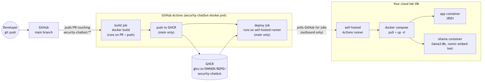

# Deployment

This describes how code gets from a `git push` to a running container on
your cloud lab VM.



## Overview

1. You push to `main` (or open a PR) on GitHub.
2. GitHub Actions ([.github/workflows/docker-build-deploy.yml](.github/workflows/docker-build-deploy.yml))
   builds the Docker image. On PRs it only builds (to catch breakage). On
   `main`, it also pushes the image to GitHub Container Registry (GHCR).
3. A **self-hosted runner** registered on your lab VM picks up the deploy
   job, pulls the new image, and restarts the stack with `docker compose`.

GitHub Actions itself never hosts the running app - it only builds/pushes
the image and, via the self-hosted runner, tells your VM to update itself.
The VM (with Docker + Ollama) is what actually serves traffic.

## One-time setup

### 1. Enable GHCR for this repo

No extra setup needed for public images - the workflow's `GITHUB_TOKEN`
already has `packages: write` (granted via the `permissions:` block in the
workflow). If you want the image private, GHCR packages inherit repo
visibility by default; the lab VM's runner will already be authenticated
(see below) so it can still pull it.

Note: GHCR image refs must be lowercase, so the workflow lowercases
`c-halik/AIThreatNotebook` to `ghcr.io/c-halik/aithreatnotebook` when
tagging - keep that in mind if you reference the image path manually.

### 2. Register a self-hosted runner on your lab VM

On your cloud lab VM (needs Docker + Docker Compose installed):

1. In GitHub: repo -> **Settings -> Actions -> Runners -> New self-hosted runner**.
2. Follow the generated `./config.sh` commands on the VM - add the label
   `security-lab` when prompted (or edit the label list), matching
   `runs-on: [self-hosted, security-lab]` in the workflow.
3. Install it as a service so it survives reboots:
   ```bash
   sudo ./svc.sh install
   sudo ./svc.sh start
   ```
4. Nothing else to pre-stage - `actions/checkout` pulls a fresh copy of the
   repo into the runner's work directory on every job.

The runner only makes **outbound** connections to GitHub to poll for jobs -
you don't need to open any inbound ports on the VM for this to work.

### 3. Authenticate the VM's Docker to pull from GHCR (private images only)

Skip this if the package is public. Otherwise, on the VM:

```bash
echo "<a GitHub PAT with read:packages scope>" | docker login ghcr.io -u <your-username> --password-stdin
```

### 4. First run on the VM

The deploy job writes `.env` itself (with
`APP_IMAGE=ghcr.io/c-halik/aithreatnotebook:latest`) before running
`docker compose pull && docker compose up -d`, so there's nothing to
pre-stage. Ollama's model volume (`ollama_data`) persists across deploys, so
models are only pulled once.

## Ongoing workflow

Every push to `main`:
1. Builds and pushes a new image tagged `latest` and with the commit SHA.
2. Deploys automatically by pulling `latest` and running
   `docker compose up -d` on the lab VM.

To roll back, re-run a previous successful workflow run from the Actions
tab, or manually on the VM:
```bash
docker compose pull app@sha256:<digest-of-known-good-build>
docker compose up -d
```

## Resource notes

`llama3:8b` needs meaningfully more than its ~4.7GB of weights to run
comfortably - during local testing, Docker Desktop's default 4GB VM memory
limit caused the model process to be OOM-killed. Size your lab VM (or
Docker's resource limits, if running Docker Desktop anywhere) with **at
least 8GB of RAM** dedicated to the Ollama container, more if you switch to
a larger model. A GPU is optional but makes inference dramatically faster
than CPU-only - see the commented-out `deploy.resources.reservations`
block in `docker-compose.yml` if your VM has an NVIDIA GPU.

Also worth knowing: Docker Desktop on macOS has no GPU/Metal passthrough to
Linux containers, so if you test this stack locally on a Mac, Ollama runs
CPU-only there regardless of the host's Apple Silicon GPU. Your actual Linux
cloud lab VM doesn't have this limitation.
